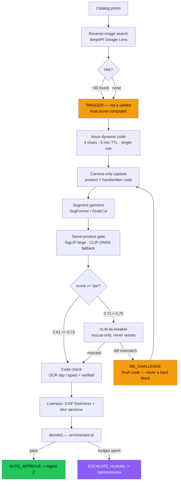
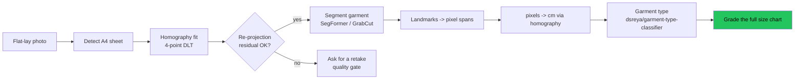
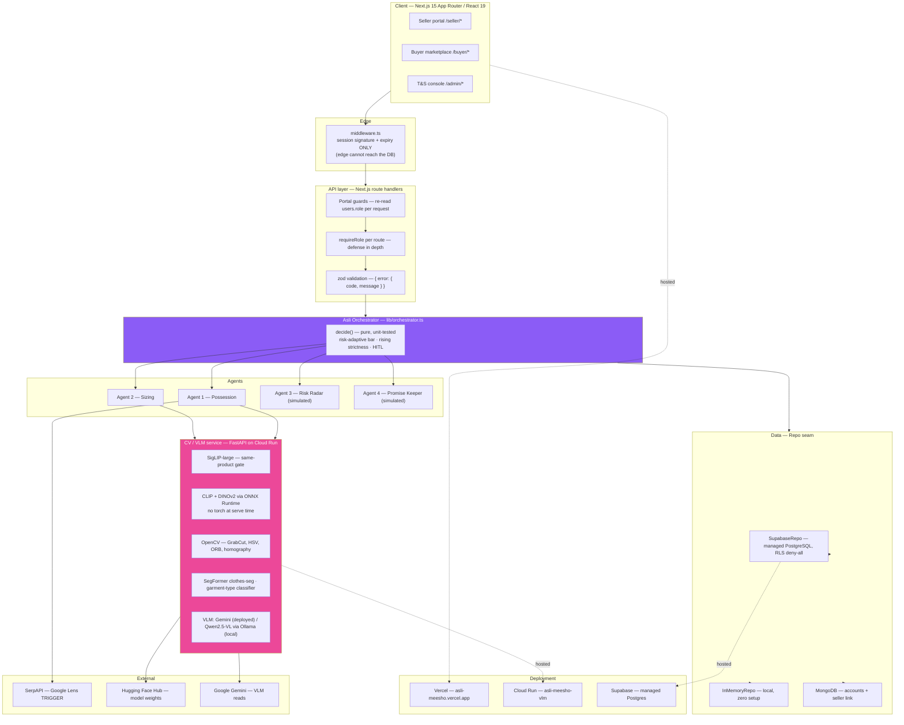
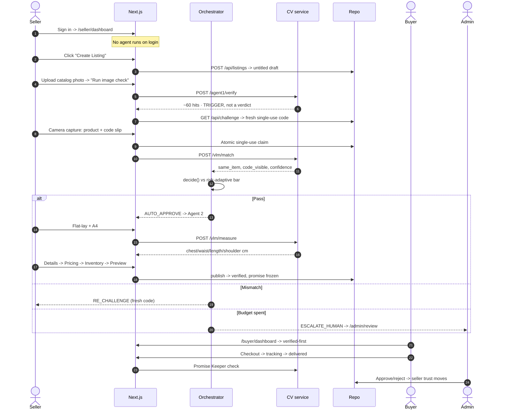
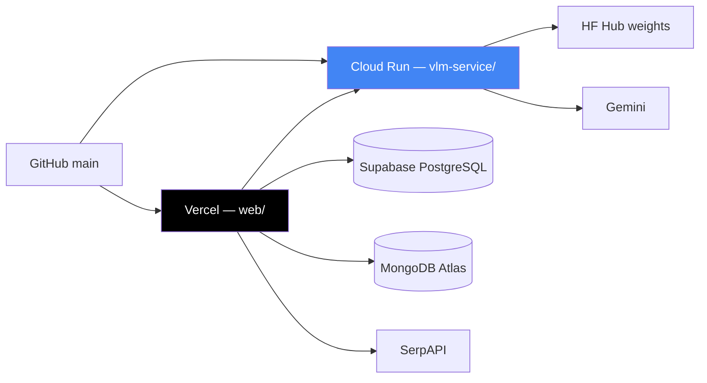

<div align="center">

<!-- TODO: replace with an exported logo (suggested: docs/assets/logo.png, ~320px wide) -->

# असली **Asli**

### 🛡️ Proof at the point of listing — a multi-agent trust layer for Meesho

**Stop bad listings _before_ they go live.**

A seller can't publish until they prove — on camera, in seconds — that they **physically hold** the product and that the size chart was **measured, not guessed**.

[](https://asli-meesho.vercel.app)
[](https://asli-meesho-vlm-287402258660.us-central1.run.app/health)


**[Live Demo](https://asli-meesho.vercel.app)** ·
**[Video Walkthrough](#)** <!-- TODO: paste the demo video URL --> ·
**[GitHub](https://github.com/sreyadattagupta/asli_meesho)** ·
**[5-minute demo script](#-demo-script-5-minutes)**

Built for **Meesho ScriptedBy{Her} 2.0 — Round 3**

</div>

---

## 🧵 What is Asli?

Two problems drive most of Meesho's fashion returns — **"not as pictured"** and **wrong size** — and both are born the instant a listing is published, not at delivery where they're merely discovered. Asli moves the check **upstream to the moment of listing**: a small team of AI agents makes every seller *prove possession* and *prove real measurements* before a product can ever reach a buyer.

> **Prevention, not detection.** Asli complements Meesho's **Project Suraksha** — Suraksha removes what's already live; Asli stops it *reaching* live. It is deliberately **not** counterfeit detection.

### ⚡ How it works — in one glance

<div align="center">

`📸 Upload photo` → `🔍 Reverse-image trigger` → `🔑 Prove possession` → `📏 Measure the size` → `✅ Asli Verified` → `🛒 Ranked first`

</div>

A downloaded catalog photo **cannot** answer the possession challenge. Someone holding the real product answers it in **~8 seconds**. That asymmetry is the whole design.

---

## 🤖 Meet the agents

Behind the flow, an **orchestrator** routes each listing by risk to specialist agents, then a **Decision Engine** owns one final, *explainable* trust score. Every agent has exactly one job:

| | Agent | Its job — in plain terms | Powered by |
|:--:|---|---|---|
| 🔑 | **Agent 1 · Possession-Proof** ★ | *"Do you actually have this?"* — matches the live capture against the catalog photo and checks that a single-use code is visible and freshly shot. | **Real models** — SigLIP / CLIP embeddings + a VLM cross-check |
| 📏 | **Agent 2 · Smart Sizing** | *"Is the size real?"* — measures chest / waist / length in **centimetres** from a flat-lay beside an A4 sheet: geometry you can verify, not a guess. | **Real CV** — single-view homography |
| 🛰️ | **Agent 3 · Risk Radar** | *"How much should we trust this seller?"* — turns history, KYC and image-reuse into a trust band, so trusted sellers earn a fast lane. | Deterministic engine over persisted signals |
| 📦 | **Agent 4 · Promise Keeper** | *"Did it arrive as promised?"* — freezes the listing's promises at go-live and checks them against the delivery photo. | Simulation over persisted state |
| ⚖️ | **★ Decision Engine** | Composes every signal into the final verdict — **approve, re-challenge, or escalate to a human** — always with a reason. Never a silent yes/no. | **Real** — a pure, fully unit-tested function |

**`✓ Asli Verified` requires Agent 1 _and_ Agent 2 to pass.** Nothing ever auto-blocks an honest seller: a mismatch always earns a fresh code, and only genuinely ambiguous cases reach a human reviewer.

> 🟢 Agents **1 & 2 are real models end-to-end.** Agents **3 & 4 are honest working simulations** — real code, real persisted state, real explainable output — standing in for data Meesho already owns (a seller-history DB, a logistics API). They're clearly labelled `simulated` in the UI.
> 📐 Want the internals — thresholds, calibration, the retry state machine? Jump to **[§4 · AI agent architecture](#4-ai-agent-architecture)**.

---

## Contents

| | | |
|---|---|---|
| [1. Problem](#1-the-problem) | [8. Tech stack](#8-technology-stack) | [15. Security](#15-security) |
| [2. Solution](#2-solution-overview) | [9. Folder structure](#9-folder-structure) | [16. Testing](#16-testing) |
| [3. Features](#3-features) | [10. Local setup](#10-local-setup-guide) | [17. Deployment](#17-deployment) |
| [4. AI agents](#4-ai-agent-architecture) | [11. Env variables](#11-environment-variables) | [18. Attribution](#18-open-source-attribution) |
| [5. Architecture](#5-complete-system-architecture) | [12. API reference](#12-api-documentation) | [19. Roadmap](#19-future-improvements) |
| [6. Workflow](#6-project-workflow) | [13. Screenshots](#13-screenshots) | [20. Team](#20-team) |
| [7. Demo script](#-demo-script-5-minutes) | [14. Performance](#14-performance) | [21. License](#21-license) · [22. Thanks](#22-acknowledgements) |

---

## 1. The problem

Meesho's two largest return drivers are **"not as pictured"** and **wrong size**. Both are created the
moment a listing is published — not at delivery, where they are merely discovered.

| What happens | Why it happens |
|---|---|
| A seller lists a product they do not physically hold | Anyone can download a supplier's catalog photo and publish it. Nothing at listing time asks *"do you actually have this?"* |
| The size chart is invented | Sellers copy a generic chart or guess. Nobody measures the garment. |
| The buyer discovers both at delivery | The cost is already sunk: shipping, reverse logistics, refund, and trust. |

**Size drives 40–60% of fashion returns** [S9]. Meesho's **Project Suraksha** removed **42 lakh
listings in six months** [S7] — real, effective enforcement, but it acts *after* a listing is live,
once buyers can already be harmed.

### Why existing approaches fall short

- **Post-hoc takedowns** are the current model. The listing must exist — and usually must hurt someone — before it can be removed.
- **Counterfeit detection** answers *"is this brand fake?"*. That is a different question from *"do you actually have this item, and is this its real size?"* — which is what most Meesho returns are about.
- **Reverse-image search alone cannot decide anything.** An honest reseller legitimately uses a supplier's photo. Treating a match as guilt punishes the majority to catch a minority.

### Why Asli is different

Asli moves the check **upstream to the point of listing** and makes the seller prove two concrete
facts before publish:

1. **Possession** — photograph the product next to a **dynamic, single-use, time-bound code**.
2. **Real size** — lay it flat beside an A4 sheet; **computer vision measures it in centimetres**.

> **Positioning: prevention, not detection.** Asli *complements* Project Suraksha rather than
> replacing it — Suraksha catches what is already live; Asli stops it reaching live. It is explicitly
> **not** counterfeit detection.

---

## 2. Solution overview

Before a listing goes live it passes through an **orchestrator** that routes it to specialist agents
by risk, then to a **Unified Decision Engine** that owns the final, explainable trust score.

The core mechanic is the **possession challenge**:

1. The seller uploads a catalog photo.
2. Reverse-image search runs — as a **trigger only**. A match never blocks; it means "prove it".
3. The system issues a **fresh 4-character code**, valid ~5 minutes, usable **once**.
4. The seller writes it on paper and photographs it **next to the product, camera only** — no gallery upload.
5. Vision models check three **independent** gates: *same item?*, *code visible?*, *taken live?*

A downloaded image cannot answer that challenge. Someone holding the real product answers it in
seconds. That asymmetry is the whole design.

**Agent 2** then measures the garment from a flat-lay against an A4 reference using **single-view
homography** — real centimetres with a checkable residual, not a model's opinion. `✓ Asli Verified`
requires **Agent 1 ∧ Agent 2**.

Verified listings rank first in a real buyer marketplace with an explainable "why you can trust this"
panel. Ambiguous ones reach a **human reviewer**, whose decision feeds back into seller trust.

---

## 3. Features

| Feature | Description | User benefit |
|---|---|---|
| **Possession challenge** | Dynamic single-use code + camera-only capture, judged by an embedding gate and a VLM cross-check | Buyer: the seller demonstrably held it. Seller: an honest listing clears in ~8s |
| **AI size measurement** | A4-referenced homography measures chest/waist/length/shoulder in cm | Buyer: the chart is measured — the #2 return cause, addressed |
| **Reverse-image trigger** | Live SerpAPI Google Lens scan; a hit raises scrutiny, **never blocks** | Seller: reusing a supplier photo stays legitimate |
| **Risk-adaptive bar** | Required confidence rises for new sellers and repeat attempts; trusted sellers get a fast lane | Seller: your record earns you speed |
| **Explainable verdicts** | Every decision carries reason + confidence + the bar it had to clear | Buyer/reviewer/judge: no silent verdicts |
| **Human-in-the-loop** | Ambiguous listings escalate to a real queue with full agent context | Nobody is dead-ended by a model |
| **Never-block policy** | A mismatch always earns a retry with a fresh code; only an exhausted budget escalates | Honest sellers are never auto-rejected |
| **Verified-first marketplace** | Grid boosts ✓ Asli Verified, with measured chart + trust panel | Buyer: trust is visible before purchase |
| **Promise Keeper** | Listing promises frozen at go-live, checked against the delivery photo | Buyer: *"did it arrive as promised?"* answered |
| **Order-scoped messaging** | A thread exists only where an order exists | No channel for unsolicited contact |
| **Trust & Safety console** | Review queue, metrics, Seller 360, agent monitor, CSV reports | Operator: the loop is real and auditable |
| **Bharat-first UX** | Hindi/English, Web Speech voice guidance, 390px-first, ≥44px targets | Low-literacy sellers can complete the flow |

> **Honest labelling.** Agents 3 and 4 are **working simulations** — real code, real persisted state,
> real explainable output — standing in for data Meesho would own (seller-history DB, logistics API).
> They are labelled `simulated` in the UI. Agents 1 and 2 are real models end to end.

---

## 4. AI agent architecture

| # | Agent | Input | Output | Status |
|---|---|---|---|---|
| **1** | **Possession-Proof** ★ | catalog photo, live capture, code | `same_item`, `code_visible`, `confidence`, `reason` | **Real models** |
| **2** | **Smart Sizing** | flat-lay + A4/tape reference | `chest/waist/length/shoulder_cm`, `confidence`, size | **Real CV** |
| **3** | **Risk Radar** | seller history, KYC, image reuse | `trustScore`, `band`, `fastLaneEligible` | Simulation (deterministic engine over persisted signals) |
| **4** | **Promise Keeper** | frozen promise + delivery photo | `promiseKept`, `mismatches[]` | Simulation |
| **★** | **Decision Engine** | all of the above | final trust score + verdict | **Real** — composes and explains |

### Agent 1 — how the gate decides



**Three independent gates.** `same_item`, `code_visible` and *taken-live* are evaluated separately and
must each hold. A screenshot of a screen fails liveness; the wrong item fails same-item; a stale code
fails the atomic single-use claim — **before any model runs**.

**The gate is calibrated, not vibes.** Thresholds come from `Marqo/deepfashion-inshop`
(`vlm-service/scripts/eval_matcher.py`) and are recorded in `models/same_item_calibration.json`:

| Signal | Role | Bar | Measured on the real fixtures |
|---|---|---|---|
| SigLIP-large cosine | **primary gate** (deployed) | 0.82 | loaded on Cloud Run |
| CLIP `clip/max` (ONNX) | gate fallback (local) | **0.75** | genuine **0.81** → pass · different dress **0.71** → reject |
| DINOv2 `dino/max/cls` | **evidence only** | — | measured to add no discrimination here — so it does not gate |
| VLM feature comparison | **rescue only**, below the bar | — | never vetoes a pass |

> **An honest limitation, recorded in the artifact itself:** *no* embedding separates
> same-category + same-colour look-alikes (AUC 0.53–0.67 on hard negatives). That adversarial case is
> deliberately deferred to the single-use code, liveness, reuse detection and human review — rather
> than papered over with a threshold that would reject honest sellers.

### Orchestration, confidence, retries

`decide()` in `web/lib/orchestrator.ts` is a **pure function** over typed signals — no I/O, fully
unit-tested. Routes never hardcode the path.

```ts
type OrchestratorAction = "AUTO_APPROVE" | "RE_CHALLENGE" | "ESCALATE_HUMAN" | "BLOCK";
decide(signals: AgentSignals): { action, requiredConfidence, reason }
```

**The bar is risk-adaptive** — never a magic constant:

| Signal | Effect on the bar | Why |
|---|---|---|
| `sellerIsNew` | **+0.03** | Cold start — no record to trust yet |
| `attempt` (first 3) | **+0.01** each, then plateaus | Repeated failure raises suspicion — but must not wall out honest sellers |
| `reverseImageMatches` | **no effect — deliberately** | Invariant #1: reuse is a *trigger*. Charging an honest reseller a harder proof for using a supplier photo would punish normal behaviour |
| Ceiling | **0.82** hard cap | Above sits the genuine band (~0.83+); a higher bar rejects real sellers forever |

**Retry strategy — the flow never hard-blocks.** A mismatch always earns another capture with a
**fresh** code (invariant #3). After `MAX_ATTEMPTS = 10` it goes to a **human**, not a wall. An honest
seller is never dead-ended; a thief is caught by a reviewer, not an auto-verdict.

**Explainability** is a product requirement *and* the audit trail. Every check persists to
`AUTHENTICITY_CHECK` with agent, payload, confidence, action, required bar and reason — surfaced to
seller, buyer and reviewer alike.

### Agent 2 — measurement, not opinion



An A4 sheet has a known aspect ratio, so it calibrates pixels→cm exactly. This is **single-view
metrology** (Criminisi, Reid & Zisserman, IJCV 2000) — a geometric computation you can check, not a
language model guessing.

### Inter-agent communication

Agents never call each other. The orchestrator owns sequencing; agents return typed signals; state
persists so a retry survives a reload. **Agent 2 is unreachable until Agent 1 passes** — enforced by
the step machine, not by UI convention.

---

## 5. Complete system architecture



| Layer | What it does | Why it is built this way |
|---|---|---|
| **Client** | Three portals, two skins: dark "trust" for seller/admin, bright Meesho retail for the buyer | A marketplace and a verification console are different products to the eye |
| **Edge** | Verifies the session **signature and expiry only** | Middleware runs on the edge and **cannot reach the database**. Any role it enforced would be a cookie claim that goes stale the moment an admin changes it |
| **API** | Portal guards re-read `users.role` per request; each route re-checks; zod validates | Database-driven role detection. Three layers, each assuming the previous may be bypassed |
| **Orchestrator** | Computes the next action from live signals | Keeps the agentic core pure and testable; routes never hardcode a path |
| **Agents** | Specialists returning typed signals | Swappable behind stable contracts |
| **CV service** | Owns deterministic vision + calibrated confidence | Python is where the CV ecosystem lives; ONNX means no torch at serve time |
| **Data** | One `Repo` interface, two implementations | Local dev needs zero setup; production needs managed Postgres. Same code above the seam |
| **External** | Trigger, weights, generative reads | Each has a labelled fallback — the demo never hard-fails |

---

## 6. Project workflow



**Why the agents run before the forms.** The wizard is `Upload → Agent 1 → Agent 2 → Details →
Pricing → Inventory → Preview → Publish`. A listing that cannot prove possession is stopped either
way — making an honest seller fill three forms first only wastes their time. Drafts are therefore
created **untitled**; the publish route re-validates the title so an untitled draft can never reach
the marketplace.

**Previous is blocked across the agent boundary**, and that is load-bearing: re-entering the challenge
would burn a spent single-use code or hand back a reusable one — exactly the reuse invariant #3
exists to stop. "Start over" issues a fresh code instead.

---

## 🎬 Demo script (5 minutes)

> **Live:** https://asli-meesho.vercel.app · No webcam? The challenge step offers **labelled demo
> fixtures** (genuine / thief / wrong code). They supply the photo — the gate judging it is the real one.

| # | Persona | Do this | What it proves |
|---|---|---|---|
| 1 | **Seller** | Sign in → land on `/seller/dashboard` | **No agent runs on login.** AI starts only when you click Create Listing |
| 2 | **Seller** | Create Listing → demo catalog photo → Run image check | *"Seen on ~60 places online"* with real Myntra/Amazon/Flipkart/Meesho hits — **TRIGGER, not a verdict** |
| 3 | **Seller** | Get today's code → capture with the **genuine** fixture | **PASS ≈0.87.** Reason shown: *"CLIP same-item 0.81 (≥ 0.75 bar), code verified, focus 617"* |
| 4 | **Seller** | Flat-lay + A4 → Measure | **chest 36.7 · waist 30.4 · length 34.6 · shoulder 33.5 cm**, homography residual 0.0 |
| 5 | **Seller** | Details → Pricing → Inventory → Preview → **Publish** | Confetti, **✓ Asli Verified**, live in the marketplace |
| 6 | **Seller** ★ | Start over → challenge with the **thief** fixture | **Blocked ≈0.45**, and the VLM says why: *"the first photo shows a black dress with purple floral embroidery… the second a pink dress"* ← **the money shot** |
| 7 | **Seller** | Replay the same code | **Refused** — single-use enforced atomically |
| 8 | **Buyer** | `/buyer/dashboard` → detail → "Why you can trust this" → checkout → fast-forward → delivered | Verified-first ranking, measured chart, Promise Keeper |
| 9 | **Admin** | `/admin/dashboard` → review queue → approve → Seller 360 → Reports | Human-in-the-loop closes the loop; trust score moves; CSV export |

---

## 8. Technology stack

| Technology | Purpose | Reason for choosing | Alternative considered |
|---|---|---|---|
| **Next.js 15** (App Router) | Frontend + API routes | One deploy unit; Server Components keep secrets server-side by default | Vite SPA + separate Node API — two deploys, more seams |
| **React 19 + TypeScript 5.7** strict | UI + typed contracts | Contracts typed route→client→store→component catch drift at build time | Plain JS — rejected; the agent contracts *are* the product |
| **Tailwind 3.4** | Styling | Two coherent skins from one token set | CSS Modules — more files, weaker consistency |
| **Framer Motion 12** | Motion | Streaming VLM progress and verdict reveals need real state animation | CSS transitions — cannot express `AnimatePresence` |
| **Zustand 5** | Client state | The seller flow must survive reloads; `persist` gives that in ~10 lines | Redux — ceremony for one flow |
| **zod 4** | Route validation | One schema per route + a normalized error envelope | Hand-rolled checks — drift silently |
| **FastAPI** | CV service | The CV/ML ecosystem is Python; async + multipart out of the box | Node CV — bindings are second-class |
| **ONNX Runtime** | CLIP/DINOv2 inference | **No torch at serve time** — the same path runs on local py3.14 and the py3.11 image; small, fast, CPU-only | torch at runtime — GBs of image, GPU expectations |
| **OpenCV** | Segmentation, homography, ORB | The metrology and colour gates are classical CV, and better for it: a residual you can check | "Ask the VLM for the size" — unfalsifiable |
| **SigLIP-large / CLIP** | Same-product gate | Calibrated on a real dataset; SigLIP primary where RAM allows | A custom siamese net — no data or time to train honestly |
| **Gemini / Qwen2.5-VL** | Generative reads | Switchable: free local Ollama, or Gemini where there is no GPU | One hard-coded provider — no degradation path |
| **Supabase (PostgreSQL)** | Deployed store | Managed Postgres, RLS deny-all, service key server-side | Self-hosted PG — ops time we do not have |
| **MongoDB** | Accounts | Owns the account→`sellerId` link, so rebuilding the app store never orphans a seller's listings | — |
| **Hand-rolled HS256 JWT** | Sessions | `node:crypto` — **zero new dependency**; keeps the "JWT" claim honest | **Auth0 — evaluated, not used.** See below |
| **Vitest + Playwright** | Tests | Pure engines unit-tested; 3-persona flows driven in a real browser | Manual QA — does not survive a refactor |
| **Vercel + Cloud Run** | Deploy | Frontend at the edge; CV service where CPU and RAM are cheap | All-in-one — the CV image is too heavy for serverless |

> ### ⚠️ On Auth0 — an honest correction
> Earlier planning documents describe **Auth0 + JWT**. **The shipped code does not use Auth0.**
> `web/lib/session.ts` implements HS256 sessions with `node:crypto`, and accounts live in MongoDB.
> There is no `@auth0/nextjs-auth0` in `package.json`. The `auth0Sub` column name is legacy — it
> stores `email|<address>`. The "JWT" half of that claim is real; the provider is not. This README
> documents what the code does, not what the deck said.

---

## 9. Folder structure

```
asli_meesho/
├── web/                    # Next.js frontend + API routes  -> Vercel
├── vlm-service/            # FastAPI CV/VLM service         -> Cloud Run
├── supabase/migrations/    # PostgreSQL schema (0001 -> 0004)
├── prompts/                # single source of VLM prompts (shared py + ts)
├── docs/                   # design docs + specs
└── ATTRIBUTION.md          # every dependency, version, license
```

| Directory | Purpose |
|---|---|
| `web/app/seller/*` | Seller portal. `layout.tsx` **is** the role guard; `create-listing/` is the 8-phase wizard |
| `web/app/buyer/*` | Marketplace. Grid and detail are **public** — a storefront is browsable signed-out; checkout/orders/profile guard themselves |
| `web/app/admin/*` | T&S console — review queue, metrics, Seller 360, users, CSV reports |
| `web/app/api/*` | Route handlers. Each validates with zod and re-checks the role |
| `web/lib/orchestrator.ts` | **The agentic core** — `decide()`, `FLOW_ORDER`, `FLOW_PHASES`, `prevStep()`. Pure, no I/O |
| `web/lib/roles.ts` | Single `ROLE_HOME` source + `safeReturnTo()` (open-redirect guard) |
| `web/lib/guards.ts` | Server-layout portal guards — re-read `users.role` per request |
| `web/lib/nav.ts` | The one navigation model — sidebar, breadcrumbs and active state all derive from it |
| `web/lib/db/` | `repo.ts` interface + `inMemoryRepo` / `supabaseRepo`. **Every route talks to `repo`**, never a client directly |
| `web/lib/engines/` | `riskRadar` · `promiseKeeper` · `decisionEngine` · `exif` — pure, unit-tested |
| `web/lib/messages.ts` | The **only** copy of the "who may read this thread" rule |
| `web/components/ui/` | Reusable primitives — skin-aware where both surfaces use them |
| `web/components/flow/` | Wizard steps + `WizardNav` (Prev/Next/Save Draft/Cancel) |
| `vlm-service/agent1/` | Agent 1 engine — `pipeline`, `reverse`, `evidence`, `score`, `forensics`, `crosscheck` |
| `vlm-service/models/` | Pinned ONNX artifacts + `same_item_calibration.json` (the gate's operating point) |
| `vlm-service/scripts/` | `eval_matcher.py` (calibration), ONNX exporters (torch only at export time) |
| `web/e2e/` | Playwright — `demo.spec.ts` (3 personas), `routing.spec.ts` (routing contract) |

---

## 10. Local setup guide

### Prerequisites

| Tool | Version | Why it is needed | If you skip it |
|---|---|---|---|
| **Node.js** | ≥ 20 (22 recommended) | Runs Next.js and the tests | Nothing in `web/` runs |
| **npm** | ≥ 10 (ships with Node) | Installs web dependencies | — |
| **Python** | 3.11–3.14 | Runs the CV service | Agents 1 & 2 return `503 agent1_unavailable`; the rest of the app still works |
| **Git** | any | Clone the repo | — |
| **Ollama** | latest | Local VLM (Qwen2.5-VL) at **$0/call** | Set `VLM_BACKEND=gemini` and use a Gemini key |
| **Docker** | optional | Only to build the CV image the way Cloud Run does | Not needed for local dev |

> **Python 3.11 vs 3.14 — both work.** On **3.14**, two optional dependencies have no wheels:
> `paddlepaddle` (OCR) and `torch`. The code degrades honestly — OCR falls back to VLM reads, SigLIP
> falls back to the CLIP-ONNX gate. Everything still runs. **3.11** gets the full set.

### 1 — Clone

```bash
git clone https://github.com/sreyadattagupta/asli_meesho.git
cd asli_meesho
```

### 2 — Web app

```bash
cd web
npm install     # installs from package-lock.json — ~1-3 min on a warm cache
```

`npm install` reads `package.json` / `package-lock.json` and materialises `node_modules` at the exact
locked versions, so your build matches CI.

```bash
cp .env.example .env.local    # then fill it in — see §11
npm run dev                   # -> http://localhost:3000
```

<details>
<summary><b>Expected output</b></summary>

```
  ▲ Next.js 15.5.20
  - Local:        http://localhost:3000
  - Environments: .env.local
 ✓ Ready in 2.1s
```
</details>

### 3 — CV / VLM service

```bash
cd ../vlm-service
python -m venv .venv

# Windows (PowerShell)
.\.venv\Scripts\Activate.ps1
# macOS / Linux
source .venv/bin/activate

pip install -r requirements.txt      # ~2-5 min
uvicorn main:app --reload --port 8000
```

A virtual environment keeps these packages off your system Python — OpenCV and ONNX Runtime pin
versions you do not want globally.

<details>
<summary><b>Expected output</b></summary>

```
INFO:     Uvicorn running on http://127.0.0.1:8000
INFO:     Application startup complete.
```

Then `curl http://localhost:8000/health`:

```json
{ "status": "ok", "vlm_backend": "ollama", "ollama_reachable": true,
  "model": "qwen2.5vl:3b",
  "same_item_gate": { "primary": "clip_onnx", "available": true } }
```

`"primary": "clip_onnx"` is **correct and expected** on a machine without torch — it is the labelled
fallback. Deployed, this field reads `"primary": "siglip"`.
</details>

### 4 — Ollama (local VLM, optional)

```bash
ollama pull qwen2.5vl     # ~6 GB. CPU-only machine? use: ollama pull moondream
ollama serve              # -> http://localhost:11434
```

### 5 — Open the app

| Persona | URL | Notes |
|---|---|---|
| Landing | http://localhost:3000 | Public |
| **Seller** | http://localhost:3000/seller/dashboard | Create Listing runs the agents |
| **Buyer** | http://localhost:3000/buyer/dashboard | Public storefront |
| **Admin** | http://localhost:3000/admin/dashboard | Review queue, metrics, reports |

### Demo credentials

There are none, by design — **create an account** at `/login` ("Create account" → Seller or Buyer).
Admin is not self-serviceable: an existing admin promotes a user at `/admin/users`.

For local development only, set `AUTH_TEST_BYPASS=1` in `.env.local` to reveal one-click persona
buttons on `/login`. It is hard-gated off when `NODE_ENV=production` **in code**, so it can never ship.

### Troubleshooting

<details>
<summary><b>Port already in use (3000 / 8000 / 11434)</b></summary>

```bash
npm run dev -- -p 3001                       # web
uvicorn main:app --reload --port 8001        # CV service (then update VLM_SERVICE_URL)
# Windows: find and kill the holder
netstat -ano | findstr :3000
taskkill /PID <pid> /F
```
</details>

<details>
<summary><b><code>503 agent1_unavailable</code> when clicking "Run image check"</b></summary>

The web app cannot reach the CV service. Check `curl http://localhost:8000/health`, then confirm
`VLM_SERVICE_URL` in `web/.env.local` matches the port uvicorn actually bound.
</details>

<details>
<summary><b>The first VLM call takes minutes / times out at 120s</b></summary>

Cold model load — SigLIP-large and SegFormer download and load on first use. Subsequent calls take
~8s (challenge) and ~11s (sizing). If the process is *killed* instead, you are out of RAM (below).
</details>

<details>
<summary><b>The service dies while loading models (OOM)</b></summary>

SigLIP-large needs several GB. On a machine with ~1 GB free it is killed mid-load. **This is handled:**
without `torch` installed the service never attempts SigLIP and cleanly uses the CLIP-ONNX gate. If
you installed torch and now see crashes, `pip uninstall torchvision torch` restores the fallback.
</details>

<details>
<summary><b><code>ModuleNotFoundError</code> / pip cannot find paddlepaddle or torch</b></summary>

Expected on Python 3.14 — neither publishes cp314 wheels. Both are **optional**: OCR degrades to VLM
reads and SigLIP to CLIP-ONNX. Use Python 3.11 for the full set.
</details>

<details>
<summary><b>Node version mismatch</b></summary>

Next.js 15 needs Node ≥ 18.18 (we build on 22). Check `node -v`, then install 22 LTS via nvm or fnm.
</details>

<details>
<summary><b>Ollama: connection refused / model not found</b></summary>

`ollama serve` must be running and the model pulled — `ollama list` should show `qwen2.5vl`.
Low VRAM? `OLLAMA_NUM_GPU=0` forces CPU, or use `moondream`.
</details>

<details>
<summary><b>SerpAPI quota exhausted</b></summary>

The free tier is ~100/month and results are cached by image hash. With no key the trigger degrades to
a labelled mock and the demo still runs — the trigger never blocks anyone by design.
</details>

<details>
<summary><b>Windows: "running scripts is disabled" when activating the venv</b></summary>

```powershell
Set-ExecutionPolicy -Scope CurrentUser -ExecutionPolicy RemoteSigned
```
Or use `.\.venv\Scripts\activate.bat` from cmd.
</details>

<details>
<summary><b>The camera does not open on the challenge step</b></summary>

`getUserMedia` needs a secure context: `localhost` qualifies, a LAN IP does not. Use
`npm run dev:https`, or use the labelled demo fixtures on that step.
</details>

---

## 11. Environment variables

### `web/.env.local`

| Variable | Description | Default | Required | Example |
|---|---|---|---|---|
| `SESSION_SECRET` | HMAC key signing session cookies | `dev-insecure-change-me` | **Yes in prod** | `openssl rand -hex 32` |
| `DATA_BACKEND` | `memory` or `supabase` | `memory` | No | `supabase` |
| `SUPABASE_URL` | Project URL | — | If `supabase` | `https://xxx.supabase.co` |
| `SUPABASE_SERVICE_ROLE_KEY` | **Server-side only.** Bypasses RLS — never `NEXT_PUBLIC` | — | If `supabase` | `eyJ…` |
| `MONGODB_URI` | Account store | — | For sign-in | `mongodb+srv://…` |
| `MONGODB_DB` | Database name | `asli` | No | `asli` |
| `VLM_SERVICE_URL` | CV service base URL | `http://localhost:8000` | No | `https://…run.app` |
| `TRIGGER_SOURCE` | `serpapi` · `qdrant` · `mock` | `serpapi` | No | `serpapi` |
| `SERPAPI_KEY` | Google Lens trigger | — | No → mock | `abc123…` |
| `GEMINI_API_KEY` | Cloud VLM | — | If `VLM_PROVIDER=gemini` | `AIza…` |
| `CHALLENGE_TTL_SECONDS` | Code lifetime (invariant #3) | `300` | No | `300` |
| `NEXT_PUBLIC_ENABLE_VOICE` | Web Speech guidance | `true` | No | `true` |
| `NEXT_PUBLIC_DEFAULT_LOCALE` | `en` · `hi` | `en` | No | `hi` |
| `AUTH_TEST_BYPASS` | **Dev only.** Persona buttons. Hard-gated off in production | unset | No | `1` |

### `vlm-service/.env`

| Variable | Description | Default | Required |
|---|---|---|---|
| `VLM_BACKEND` | `ollama` · `gemini` | `ollama` | No |
| `OLLAMA_URL` | Ollama endpoint | `http://localhost:11434` | No |
| `OLLAMA_MODEL` | Local VLM | `qwen2.5vl` | No |
| `OLLAMA_NUM_GPU` | `0` forces CPU | — | No |
| `VLM_TIMEOUT` | Seconds before giving up | `120` | No |
| `GEMINI_API_KEY` | Cloud VLM key | — | If `gemini` |
| `SAME_ITEM_THRESHOLD` | Override the calibrated gate | `0.75` (artifact) | No |
| `SAME_ITEM_GATE_SIGNAL` | e.g. `clip/max` | artifact | No |

> **Missing a variable? Nothing crashes silently.** No `SERPAPI_KEY` → labelled mock trigger. No
> `SUPABASE_URL` → in-memory repo. No CV service → `503` with a retry in the UI. Every degradation is
> visible and labelled.

---

## 12. API documentation

<details open>
<summary><b>Auth &amp; users</b></summary>

| Method | Endpoint | Purpose | Auth |
|---|---|---|---|
| `POST` | `/api/auth/register` | Create account `{ email, password, name, role }` | Public |
| `POST` | `/api/auth/login` | Sign in → sets `asli_session` | Public |
| `GET` | `/api/auth/logout` | Clears the cookie | Session |
| `GET` | `/api/users/me` | `{ role, name, sellerId?, kycStatus? }` | Session |
| `POST` | `/api/users/role` | Role selection (demo provision) | Session |
| `GET` `PATCH` | `/api/admin/users` · `/api/admin/users/:id` | List / change role | **admin** |

```bash
curl -X POST https://asli-meesho.vercel.app/api/auth/register \
  -H 'Content-Type: application/json' \
  -d '{"email":"a@b.com","password":"secret123","name":"A","role":"seller"}'
# -> { "user": { "id": "…", "role": "seller", "sellerId": "…" } }
```
</details>

<details>
<summary><b>Agent 1 — possession</b></summary>

| Method | Endpoint | Purpose | Auth |
|---|---|---|---|
| `POST` | `/api/reverse-image` | Trigger. **Never a verdict** | seller |
| `GET` | `/api/challenge` | Issue a fresh single-use code | session |
| `POST` | `/api/challenge` | Verify possession | seller (listing owner) |

```bash
# multipart: catalog, live (camera), code
curl -X POST http://localhost:3000/api/challenge \
  -F catalog=@catalog.png -F live=@live.jpg -F code=6A4E
```
```json
{ "same_item": true, "code_visible": true, "confidence": 0.8744, "passed": true,
  "reason": "Same product: CLIP same-item 0.81 (>= 0.75 bar), DINOv2 evidence 0.33; code entered (text-verified); focus 617.",
  "signals": { "gate_score": 0.8145, "gate_signal": "clip/max", "gate_threshold": 0.75,
               "siglip_cosine": null, "blur_var": 617.1 } }
```
A reused or expired code returns `409 code_used_or_expired` — **before** any model runs.
</details>

<details>
<summary><b>Agent 2 — sizing</b></summary>

| Method | Endpoint | Purpose | Auth |
|---|---|---|---|
| `POST` | `/api/sizing` | Measure a flat-lay against a reference | seller |

```json
{ "provider": "cv", "garment_type": "Topwear", "reference_used": "a4",
  "chest_cm": 36.7, "waist_cm": 30.4, "length_cm": 34.6, "shoulder_cm": 33.5,
  "confidence": 0.9396, "size": "XS",
  "reason": "Measured from a detected A4 reference (homography fit, re-projection residual 0.0)",
  "signals": { "method": "homography", "residual": 0, "reference_detected": true } }
```
</details>

<details>
<summary><b>Listings · orders · messages · review · admin</b></summary>

| Method | Endpoint | Purpose | Auth |
|---|---|---|---|
| `POST` | `/api/listings` | Create draft (body `{}` — **untitled**) | seller |
| `GET` | `/api/listings` | Marketplace feed (`?filter=verified`) | Public |
| `GET` | `/api/listings/:id` | Listing + images + checks + trust | Public |
| `PATCH` | `/api/listings/:id` | Seller edits. `400 invalid_mrp` if `mrp <= price`. **Never accepts `verified`** | seller (owner) |
| `POST` | `/api/listings/:id/publish` | Go live. `409 not_verified` without possession | seller (owner) |
| `DELETE` | `/api/listings/:id` | **Archive** — never hard-delete | seller (owner) |
| `POST` | `/api/asli/analyze` | Orchestrator entry → `{ action, requiredConfidence, reason }` | seller |
| `POST` `GET` | `/api/orders` · `/api/orders/:id` · `/api/orders/:id/advance` | Mock commerce + demo fast-forward | buyer |
| `GET` `POST` | `/api/messages` | Thread / send. **404 for non-participants** | participant |
| `GET` | `/api/messages/threads` · `/api/notifications/count` | Inbox · unread badge | session |
| `GET` `POST` | `/api/review/queue` · `/api/review/:id/decision` | HITL queue + decision | **admin** |
| `GET` | `/api/admin/metrics` · `/api/admin/agents` · `/api/admin/sellers/:id` | Tiles · agent health · Seller 360 | **admin** |
| `POST` | `/api/agents/risk-radar/score` · `/api/agents/promise-keeper/check` | Agents 3 & 4 (`simulated`) | session |

> **404, not 403, for non-participants.** A 403 confirms the id exists, turning the endpoint into an
> id oracle. The same reasoning applies to another seller's listing.
</details>

<details>
<summary><b>CV service (FastAPI)</b></summary>

| Method | Endpoint | Purpose |
|---|---|---|
| `GET` | `/health` | Backend, model load state, gate in use |
| `POST` | `/agent1/verify` | Full Agent-1 pipeline (trigger + evidence + score) |
| `POST` | `/agent1/feedback` | Reviewer outcome → calibration signal |
| `POST` | `/vlm/match` | Same-item + code + liveness |
| `POST` | `/vlm/measure` | A4 homography measurement |
| `POST` | `/vlm/embed` · `/vlm/similar` | Embeddings · similarity trigger |
| `POST` | `/vlm/verify_delivery` | Promise Keeper delivery check |
</details>

---

## 13. Screenshots

> Root-level `*.png` is gitignored by design, so these are placeholders. Drop exports into
> `docs/assets/` and swap the paths.

| | |
|---|---|
| **Landing** — <!-- TODO --> `docs/assets/landing.png` | **Seller dashboard** — <!-- TODO --> `docs/assets/seller-dashboard.png` |
| **Reverse-image TRIGGER** (~60 hits) — <!-- TODO --> `docs/assets/trigger.png` | **Live possession challenge** — <!-- TODO --> `docs/assets/challenge.png` |
| **Thief blocked** ★ — <!-- TODO --> `docs/assets/thief-blocked.png` | **Measured size chart** — <!-- TODO --> `docs/assets/sizing.png` |
| **Published — ✓ Asli Verified** — <!-- TODO --> `docs/assets/verified.png` | **Buyer marketplace** — <!-- TODO --> `docs/assets/marketplace.png` |
| **Trust panel** — <!-- TODO --> `docs/assets/trust-panel.png` | **Admin console + reports** — <!-- TODO --> `docs/assets/admin.png` |

---

## 14. Performance

**Measured on the live pipeline** (Cloud Run CPU, warm models):

| Operation | Time | Notes |
|---|---|---|
| Reverse-image trigger | ~2–4s | Cached by image hash |
| Possession verify | **~8s** | Segmentation + embedding gate + code + liveness |
| Sizing measurement | **~11s** | A4 detection + homography + segmentation + grading |
| Page loads | ~100–200ms | Server Components; ~102 kB shared JS |
| First call after cold start | up to ~2 min | Model download/load; subsequent calls are warm |

**Scalability.** The web tier is stateless — every request re-reads role and data, so it scales
horizontally on Vercel with no sticky sessions. The CV service holds no session state and scales
independently on Cloud Run. The `Repo` seam means swapping in a dedicated Postgres cluster touches
one file.

**Modularity.** Contracts stay stable while implementations swap: `VlmProvider` (ollama ↔ gemini ↔
mock), `TriggerSource` (serpapi ↔ qdrant ↔ mock), `Repo` (memory ↔ supabase). None of those swaps
changes a line above the seam.

**Caching.** SerpAPI results are cached by image hash (free tier ~100/month). Models load once per
process and are reused. `listImageMeta` deliberately omits the `url` blob — inline data URLs average
~937 kB, so a feed selecting them would ship megabytes per request.

**Async.** VLM progress streams into a live checklist rather than a spinner; every async path has
loading, success and error states with retry. Nothing spins forever.

**Fault tolerance.** Every external dependency has a labelled fallback: no GPU → Gemini; no Gemini →
labelled mock; no SerpAPI → mock trigger; no SigLIP → CLIP-ONNX gate; no OCR → VLM read; no Supabase
→ in-memory. **The demo never hard-fails — and never lies about which path it took**: `/health` and
the admin agent monitor report the live state.

---

## 15. Security

| Concern | How it is handled |
|---|---|
| **Authentication** | HS256 JWT in an httpOnly cookie (`asli_session`, 7 days), signed with `SESSION_SECRET`, compared **timing-safely**. Passwords salted + hashed in MongoDB |
| **Authorization (RBAC)** | **Three layers.** Middleware = session signature/expiry only (edge, no DB). Portal guards re-read `users.role` **per request**. `requireRole` re-checks inside every route |
| **Why the role is not in the cookie** | It would go stale the instant an admin changes it — a demoted user would keep access until expiry. Roles are read from the database, every time |
| **Open redirect** | `safeReturnTo()` rejects `//evil.com` and absolute URLs, plus cross-portal targets that would bounce the user back to login |
| **Id enumeration** | Another seller's listing and a stranger's thread both return **404, not 403** — a 403 confirms existence |
| **Privilege escalation** | The login portal picker is **intent, not authorization** — the account's role wins. `PATCH /api/listings/:id` cannot set `verified`: minting the badge without proof would void the product |
| **Input validation** | zod schema per mutating route; normalized `{ error: { code, message } }` |
| **Rate limiting** | Sliding window on code issuance and messaging, keyed **per user** not per IP — one shop behind NAT should not throttle another |
| **Secrets** | Server-side only; `NEXT_PUBLIC_*` reserved for non-secret flags. `.env.local` gitignored; `SUPABASE_SERVICE_ROLE_KEY` never reaches the client |
| **Database** | Supabase RLS **deny-all with zero policies** — only the service role, server-side, touches it |
| **Dev bypass** | `AUTH_TEST_BYPASS` requires the flag **and** `NODE_ENV !== "production"`, checked in code — it cannot ship |
| **Anti-spoof** | Codes single-use (atomic claim), time-bound, camera-only; EXIF freshness + blur variance are separate signals — and advisory, since EXIF is strippable |

---

## 16. Testing

```bash
cd web
npm run test          # 228 unit + integration (vitest)
npm run e2e           # Playwright — 3 personas + routing contract
npx tsc --noEmit      # strict typecheck
npm run lint

cd ../vlm-service
pytest                # CV engine tests
```

| Layer | Covers |
|---|---|
| **Unit** | The `decide()` matrix (including *"a genuine capture always clears the bar"* at every attempt), threshold parsing, wizard step navigation, size grading, EXIF |
| **Integration** | Route RBAC, listing lifecycle, the MRP cross-field rule, challenge TTL + single-use, message participation, repo contract (**both backends satisfy the same suite**) |
| **E2E** | Buyer marketplace → trust panel; admin queue → approve; seller trigger; every legacy redirect; all 8 seller nav items; *"seller lands on dashboard with no agent started"* |
| **Calibration** | `scripts/eval_matcher.py` on `Marqo/deepfashion-inshop` — AUC/TAR@FAR recorded in the artifact rather than asserted from memory |

Notable regression tests, each written after a real bug: a misconfigured `MATCH_THRESHOLD=0.90` once
put the bar inside the genuine band and told every honest seller *"Product mismatch"*. There is now a
test that fails if the configured floor ever drifts back there.

---

## 17. Deployment



| Target | What runs | Where |
|---|---|---|
| **Vercel** | Next.js frontend + API routes | https://asli-meesho.vercel.app |
| **Cloud Run** | FastAPI CV service (`python:3.11-slim`) | `asli-meesho-vlm`, `us-central1` |
| **Supabase** | PostgreSQL, RLS deny-all | project `upczztjmzhfagfwnjoxi` |
| **MongoDB Atlas** | Accounts | — |
| **HF Hub** | Model weights | `dsreya/garment-type-classifier`, `google/siglip-large-patch16-384`, `mattmdjaga/segformer_b2_clothes` |

### Deploying

```bash
# 1. DATABASE FIRST — the app expects the schema.
#    Apply supabase/migrations/*.sql in order via the Supabase SQL editor.
#    Skipping 0004 makes every publish fail: listings.stock would not exist.

# 2. CV service
cd vlm-service
gcloud run deploy asli-meesho-vlm --source . --region us-central1 \
  --memory 4Gi --allow-unauthenticated

# 3. Frontend
cd ../web
vercel --prod
```

<details>
<summary><b>Docker (local — mirrors the Cloud Run image)</b></summary>

```bash
cd vlm-service
docker build -t asli-vlm .
docker run -p 8000:7860 --env-file .env asli-vlm
```
The image is Hugging Face Spaces-compatible (the Docker SDK frontmatter is retained in
`vlm-service/README.md`), but the live deployment is **Cloud Run**.
</details>

> **Migration order matters.** Apply `supabase/migrations/` in sequence. `0004` adds
> `listings.stock/mrp/sku` and the `messages` table — deploy the frontend without it and every
> publish returns `42703 column does not exist`.

---

## 18. Open source attribution

Full table with exact installed versions: **[ATTRIBUTION.md](ATTRIBUTION.md)**. Summary of what is
actually in this repository — nothing below is aspirational:

### Web (`web/` — Node 22)

| Name | Version | License | Role | Source |
|---|---|---|---|---|
| Next.js | 15.5.20 | MIT | App Router pages + API handlers | [docs](https://nextjs.org/docs) · [repo](https://github.com/vercel/next.js) |
| React / React DOM | 19.2.7 | MIT | UI runtime | [docs](https://react.dev) · [repo](https://github.com/facebook/react) |
| TypeScript | 5.7.3 | Apache-2.0 | Typed contracts (strict) | [docs](https://www.typescriptlang.org/docs/) · [repo](https://github.com/microsoft/TypeScript) |
| Tailwind CSS | 3.4.17 | MIT | Styling / design tokens | [docs](https://tailwindcss.com/docs) · [repo](https://github.com/tailwindlabs/tailwindcss) |
| Framer Motion | 12.42.2 | MIT | Motion, transitions, gestures | [docs](https://motion.dev/docs) · [repo](https://github.com/framer/motion) |
| Zustand | 5.0.14 | MIT | Client state + persistence | [docs](https://zustand.docs.pmnd.rs) · [repo](https://github.com/pmndrs/zustand) |
| zod | 4.4.3 | MIT | Route validation | [docs](https://zod.dev) · [repo](https://github.com/colinhacks/zod) |
| lucide-react | 1.24.0 | ISC | Icon set | [docs](https://lucide.dev) · [repo](https://github.com/lucide-icons/lucide) |
| clsx | 2.1.1 | MIT | `cn()` class merge | [repo](https://github.com/lukeed/clsx) |
| tailwind-merge | 3.6.0 | MIT | `cn()` conflict resolution | [repo](https://github.com/dcastil/tailwind-merge) |
| @supabase/supabase-js | 2.110.2 | MIT | Managed PostgreSQL client | [docs](https://supabase.com/docs) · [repo](https://github.com/supabase/supabase-js) |
| mongodb | 7.5.0 | Apache-2.0 | Account store driver | [docs](https://www.mongodb.com/docs/drivers/node/) · [repo](https://github.com/mongodb/node-mongodb-native) |
| Vitest | 4.1.10 | MIT | Unit/integration tests *(dev)* | [docs](https://vitest.dev) · [repo](https://github.com/vitest-dev/vitest) |
| @playwright/test | 1.61.1 | Apache-2.0 | E2E *(dev)* | [docs](https://playwright.dev) · [repo](https://github.com/microsoft/playwright) |
| ESLint + eslint-config-next | 9.39.5 / 15.5.20 | MIT | Linting *(dev)* | [docs](https://eslint.org) · [repo](https://github.com/eslint/eslint) |
| PostCSS / Autoprefixer | 8.4.49 / 10.4.20 | MIT | CSS pipeline *(dev)* | [repo](https://github.com/postcss/postcss) |

### CV service (`vlm-service/` — Python)

| Name | Version | License | Role | Source |
|---|---|---|---|---|
| FastAPI | ≥0.115 | MIT | Service HTTP API | [docs](https://fastapi.tiangolo.com) · [repo](https://github.com/fastapi/fastapi) |
| Uvicorn | ≥0.34 | BSD-3 | ASGI server | [docs](https://www.uvicorn.org) · [repo](https://github.com/encode/uvicorn) |
| python-multipart | ≥0.0.20 | Apache-2.0 | Image upload parsing | [repo](https://github.com/Kludex/python-multipart) |
| httpx | ≥0.28 | BSD-3 | HTTP client → Ollama/Gemini | [docs](https://www.python-httpx.org) · [repo](https://github.com/encode/httpx) |
| Pillow | ≥11.3 | HPND | Image decode / composite | [docs](https://pillow.readthedocs.io) · [repo](https://github.com/python-pillow/Pillow) |
| NumPy | ≥2.0 | BSD-3 | Homography DLT, cosine, Laplacian | [docs](https://numpy.org/doc/) · [repo](https://github.com/numpy/numpy) |
| SciPy | ≥1.13 | BSD-3 | Variance-of-Laplacian focus gate | [docs](https://docs.scipy.org) · [repo](https://github.com/scipy/scipy) |
| OpenCV (headless) | ≥4.10,<5 | Apache-2.0 | GrabCut, HSV gate, ORB, homography | [docs](https://docs.opencv.org) · [repo](https://github.com/opencv/opencv-python) |
| ONNX Runtime | ≥1.20 | MIT | CLIP/DINOv2 inference — **no torch at serve** | [docs](https://onnxruntime.ai/docs/) · [repo](https://github.com/microsoft/onnxruntime) |
| qdrant-client | ≥1.12 | Apache-2.0 | Vector similarity trigger (local mode) | [docs](https://qdrant.tech/documentation/) · [repo](https://github.com/qdrant/qdrant-client) |
| RapidFuzz | ≥3.9 | MIT | Fuzzy title/brand cross-check | [docs](https://rapidfuzz.github.io/RapidFuzz/) · [repo](https://github.com/rapidfuzz/RapidFuzz) |
| selectolax | ≥0.3 | MIT | JSON-LD / OpenGraph parse (evidence) | [repo](https://github.com/rushter/selectolax) |
| ImageHash | ≥4.3 | BSD-2 | Perceptual-hash last-resort fallback | [repo](https://github.com/JohannesBuchner/imagehash) |
| PaddleOCR *(optional)* | latest | Apache-2.0 | Code-slip OCR (no cp314 wheel → degrades) | [docs](https://paddlepaddle.github.io/PaddleOCR/) · [repo](https://github.com/PaddlePaddle/PaddleOCR) |
| transformers + torch *(optional)* | latest | Apache-2.0 / BSD-3 | SigLIP / SegFormer / AI-gen classifier | [docs](https://huggingface.co/docs/transformers) · [repo](https://github.com/huggingface/transformers) |

### Models

| Model | License | Role | Source |
|---|---|---|---|
| SigLIP-large-patch16-384 | Apache-2.0 | **Primary** same-product gate (deployed) | [HF](https://huggingface.co/google/siglip-large-patch16-384) |
| CLIP ViT-B/32 (ONNX) | MIT | Same-item gate fallback — `clip/max` | [repo](https://github.com/openai/CLIP) |
| DINOv2-small (ONNX) | Apache-2.0 | Evidence only (measured: adds no discrimination here) | [repo](https://github.com/facebookresearch/dinov2) |
| SegFormer B2 Clothes | MIT | Garment segmentation | [HF](https://huggingface.co/mattmdjaga/segformer_b2_clothes) |
| Qwen2.5-VL | Apache-2.0 | Local VLM via Ollama ($0/call) | [HF](https://huggingface.co/Qwen) |
| Gemini (Flash) | Commercial (free tier) | Deployed VLM reads | [ai.google.dev](https://ai.google.dev) |
| `dsreya/garment-type-classifier` | — | Garment type for size grading | [HF](https://huggingface.co/dsreya/garment-type-classifier) |
| `dsreya/garment-size-grader` | — | Size grading | [HF](https://huggingface.co/dsreya/garment-size-grader) |
| Organika/sdxl-detector *(optional)* | Apache-2.0 | AI-generated-image signal | [HF](https://huggingface.co/Organika/sdxl-detector) |

### Services & tooling

| Name | License | Role | Source |
|---|---|---|---|
| Ollama | MIT | Local model runtime | [site](https://ollama.com) · [repo](https://github.com/ollama/ollama) |
| SerpAPI (Google Lens) | Commercial (free tier) | Reverse-image **trigger** | [serpapi.com](https://serpapi.com) |
| Vercel | Commercial | Frontend hosting | [vercel.com](https://vercel.com) |
| Google Cloud Run | Commercial | CV service hosting | [cloud.google.com/run](https://cloud.google.com/run) |
| Supabase | Apache-2.0 (platform) | Managed PostgreSQL | [supabase.com](https://supabase.com) |
| MongoDB Atlas | SSPL / Commercial | Account store | [mongodb.com](https://www.mongodb.com) |
| Docker | Apache-2.0 | CV service image | [docker.com](https://www.docker.com) |

### Research

Bai et al. 2025 (*Qwen2.5-VL*, arXiv:2502.13923) · Criminisi, Reid & Zisserman, IJCV 2000
(*single-view metrology* — Agent 2's basis) · Radford et al. 2021 (*CLIP*) · Zhai et al. 2023
(*SigLIP*) · Oquab et al. 2023 (*DINOv2*) · Jøsang & Ismail 2002 (*beta reputation* — Risk Radar) ·
Chow 1970; Geifman & El-Yaniv 2017 (*reject option* — the escalate-don't-guess policy) ·
Malkov & Yashunin 2018 (*HNSW*) · ISO/IEC 30107-1 (*presentation attack detection*).

---

## 19. Future improvements

<details open>
<summary><b>Short term</b></summary>

- Re-calibrate the same-item gate on a **real Meesho catalog-vs-live set** — the artifact says so explicitly: deepfashion's positives are front/side/back poses, harder than a real catalog-vs-live pair
- PaddleOCR on the deployed image so `code_visible` is read from the slip rather than accepting the typed code
- Hindi coverage across buyer + admin (today: seller flow + wizard)
- Replace the notification poll with server-sent events
</details>

<details>
<summary><b>Long term</b></summary>

- **Agent 3 → real data**: swap the simulated seller-history engine for Meesho's, keeping the interface
- **Agent 4 → real logistics**: delivery photos from the courier API
- Qdrant embedding trigger at scale (HNSW) instead of SerpAPI's free tier
- Feed the trust score to **PRISM** for ranking; feed blocked-listing signals to **Suraksha**
- Reviewer decisions → continuous re-calibration (`/agent1/feedback` already accepts them)
</details>

<details>
<summary><b>Production readiness</b></summary>

- Replace demo role provisioning with **KYC-gated seller** and **invite-only admin**
- GPU fleet for SigLIP/VLM behind the same `VlmProvider` contract
- Redis for challenge TTL; dedicated PostgreSQL; WAF + CDN
- Structured audit export for compliance; per-agent latency SLOs and alerting
- Managed secrets store; short-lived service credentials
</details>

---

## 20. Team

| | Role | Links |
|---|---|---|
| **Sreya Datta Gupta** | Creator — product, full-stack, ML | [GitHub](https://github.com/sreyadattagupta) · <!-- TODO: LinkedIn --> |
<!-- TODO: add teammates if this is a team submission -->

**Team name:** <!-- TODO --> · **Submission:** Meesho ScriptedBy{Her} 2.0 — Round 3

---

## 21. License

Released under the **MIT License** — see [`LICENSE`](LICENSE). <!-- TODO: add a LICENSE file if absent -->

MIT is permissive and imposes no obligations on Meesho if any of this is adopted. Third-party
components keep their own licenses (see [ATTRIBUTION.md](ATTRIBUTION.md)); all are permissive
(MIT / Apache-2.0 / BSD / ISC / HPND). Model weights follow their upstream licenses. **MongoDB Atlas
(SSPL)** and **SerpAPI / Gemini / Vercel / Cloud Run** are consumed as hosted services, not
redistributed.

---

## 22. Acknowledgements

- **Meesho** — for a problem worth solving. Project Suraksha, PRISM, Vaani and BharatMLStack shaped the design: Asli is built to *plug into* that ecosystem, not around it.
- **ScriptedBy{Her} 2.0** — for the platform and the brief.
- **Mentors and reviewers** — for pushing on the hard question: *does this actually work, or does it just look like it works?*
- **The open-source community** — Next.js, React, FastAPI, OpenCV, ONNX Runtime, Hugging Face, Ollama, Supabase, and every maintainer listed in [ATTRIBUTION.md](ATTRIBUTION.md). This was built on your work.
- **Researchers** whose papers are the foundation here — particularly Criminisi, Reid & Zisserman, whose 2000 single-view metrology paper is why Agent 2 *measures* a garment instead of guessing at it.

<div align="center">

**असली** means *real*.

That is the whole product: real seller, real product, real size.

[Live Demo](https://asli-meesho.vercel.app) · [Demo script](#-demo-script-5-minutes) · [Architecture](#5-complete-system-architecture)

</div>
